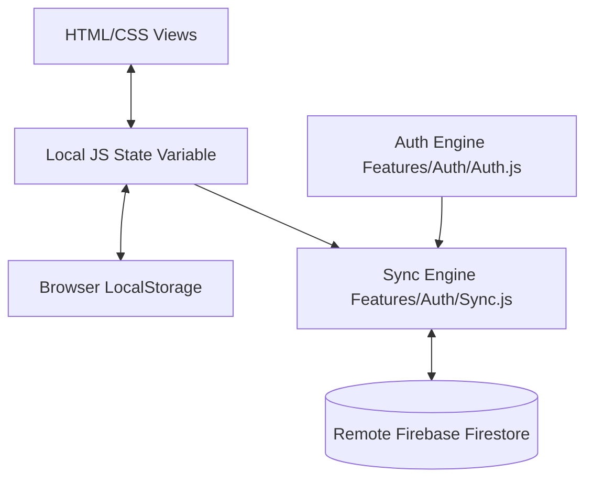

# ⚡ Squash: Squashing tasks like bugs...

[](https://github.com/yourusername/task-manager)
[](https://opensource.org/licenses/MIT)
[](http://makeapullrequest.com)
[](https://firebase.google.com/)
[](#)

A beautiful, premium, and feature-rich task management web application. Engineered with a modular frontend architecture, it supports multiple list folders, subtask trees, robust keyboard shortcuts, data export/import, active analytics, modifications lock, and real-time Firestore database synchronization with Google Sign-in.

---

## ✨ Key Features

### 🗂️ Core Task Management
- **Multiple Lists (Folders)**: Seamlessly organize tasks into dedicated list containers (e.g. Work, Personal, Shopping).
- **Subtasks tree**: Break complex tasks down into smaller checklists directly inside each task.
- **Full Text Search**: Instantly look up tasks and folders.
- **Compact Card Layout**: Visual task items rendered as sleek two-column square cards.

### 📊 Productivity Analytics Dashboard
- **Inline Dashboard Tab**: Switch between task lists and an integrated analytics layout with a single click.
- **Metrics Tracking**: Symmetrical progress rates of overall task execution, current/max daily streaks, productive weekdays, and list distribution ratios.
- **Large 365-day Heatmap**: Complete SVG matrix tracking daily completions over a 365-day grid (from Sunday to Saturday) with custom list filtering controls.

### ⏱️ Circular Focus Timer
- **Accent Progress Ring**: A circular Pomodoro countdown timer in the sidebar with a visual progress indicator bounded to the active theme accent color.
- **Quick Adjusters**: Presets (`-10m`, `-5m`, `+5m`, `+10m`) to easily increment or decrement time without tedious click iterations.
- **Run Log History**: Displays recent focal records in the right sidebar.

### 🎨 Consolidated Settings Panel
- **All-in-One Settings**: Control the **AMOLED Black theme toggle**, **Accent Color selectors**, **Bulk Actions** (clear completed from multiple lists), **In-App Changelog**, and **Shortcuts Cheatsheet** in a dedicated tab.
- **Graphite Dark Default**: Deprecated light theme to provide a high-contrast dark environment.
- **Backup & Portability**: Direct imports/exports of checklists to/from Microsoft Excel (`.xlsx`) files.
- **High-Performance Navigation**: Lightning-fast hotkeys for fully mouse-free task management workflows.

---

## 📂 Project Structure

```
Task-Manager-main/
├── favicon.svg             # Application logo
├── index.html              # Main HTML markup and view structures
├── style.css               # Vanilla CSS core design rules and variables
├── FIREBASE_SETUP.md       # Firebase setup guidelines
├── README.md               # Repository documentation (this file)
└── js/
    ├── main.js             # Orchestrator, view controllers, element caches, and startup setups
    ├── state.js            # Central shared reactive variables and cloud-sync triggers
    ├── storage.js          # Low-level LocalStorage read/write wrappers and cookie fallbacks
    ├── dom.js              # Central shared UI elements cache object
    ├── timer.js            # Pomodoro countdown algorithms and SVG progress ring bindings
    ├── charts.js           # 365-day horizontal heatmaps and filter population
    ├── folders.js          # Folder/list CRUD controllers, lock toggling, and modals
    ├── tasks.js            # Task/subtask CRUD, priority updates, text editing, and item builders
    ├── config/
    │   ├── firebase-config.example.js  # Template configurations
    │   └── firebase-config.js          # Firestore secret credentials (ignored in git)
    ├── features/
    │   └── auth/
    │       ├── auth.js     # Firebase Authentication and Sign-In operations
    │       └── sync.js     # Real-time Firestore sync & local state reconciliation
    └── ui/
        └── auth-ui.js      # Auth-related states UI update and event bindings
```

---

## ⌨️ Keyboard Shortcuts Cheatsheet

| Key | Action | Context |
| :---: | :--- | :--- |
| <kbd>N</kbd> | Focus **Add Task** Input field | Anywhere (not typing) |
| <kbd>/</kbd> | Focus **Search Tasks** Input field | Anywhere (not typing) |
| <kbd>A</kbd> | Show **All** tasks | Anywhere (not typing) |
| <kbd>1</kbd> | Show **Active** tasks | Anywhere (not typing) |
| <kbd>2</kbd> | Show **Completed** tasks | Anywhere (not typing) |
| <kbd>L</kbd> | **Toggle Lock** on current list | Anywhere (not typing) |
| <kbd>S</kbd> | **Toggle Sidebar** (Open/Collapse) | Anywhere (not typing) |
| <kbd>C</kbd> | **Cycle Accent Color** | Anywhere (not typing) |
| <kbd>Esc</kbd> | Close active modal / Unfocus active input | Inside input or open modal |

---

## 🚀 Getting Started

### 1. Clone the repository
```bash
git clone https://github.com/yourusername/task-manager.git
cd task-manager
```

### 2. Configure Firebase Database
1. Create a project in the [Firebase Console](https://console.firebase.google.com/).
2. Enable **Google Provider** in the Authentication Sign-In methods.
3. Enable **Firestore Database** in test mode, and apply security rules to restrict users to their own documents:
   ```javascript
   rules_version = '2';
   service cloud.firestore {
     match /databases/{database}/documents {
       match /users/{userId} {
         allow read, write: if request.auth != null && request.auth.uid == userId;
       }
     }
   }
   ```
4. Copy the config template:
   ```bash
   cp js/config/firebase-config.example.js js/config/firebase-config.js
   ```
5. Replace the placeholder values in `js/config/firebase-config.js` with your active Firebase configuration secrets.

### 3. Run Locally
You can run this application locally using any static web server:

**Using Python:**
```bash
python -m http.server 8080
```

**Using Node.js:**
```bash
npx http-server -p 8080
```

Open `http://localhost:8080` in your web browser.

---

## 🏗️ Architecture & Flow



- **Separation of Concerns**: Core list rendering (`main.js`), cloud synchronization (`sync.js`), and user authentication (`auth.js`) are decoupled, ensuring the UI remains active and responsive regardless of network latency.
- **Offline First**: Squash remains fully functional offline, reading and writing to Browser `LocalStorage`. When a network connection is re-established, the sync manager reconciles changes with Firestore automatically.

---

## 🤝 Contributing

Contributions make the open-source community an amazing place to learn, inspire, and create. Any contributions you make are **greatly appreciated**.

1. Fork the Project
2. Create your Feature Branch (`git checkout -b feature/AmazingFeature`)
3. Commit your Changes (`git commit -m 'Add some AmazingFeature'`)
4. Push to the Branch (`git push origin feature/AmazingFeature`)
5. Open a Pull Request

---

## 📄 License

Distributed under the MIT License. See [LICENSE](LICENSE) for more information.
