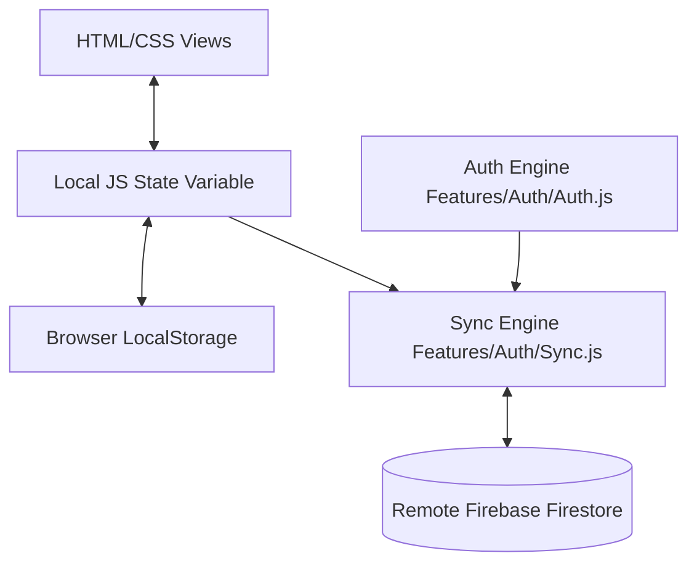

# ⚡ Squash: Squashing tasks like bugs...

[](https://github.com/yourusername/task-manager)
[](https://opensource.org/licenses/MIT)
[](http://makeapullrequest.com)
[](https://firebase.google.com/)
[](#)

A beautiful, premium, and feature-rich task management web application. Engineered with a modular frontend architecture, it supports multiple list folders, subtask trees, a dedicated notes system, robust keyboard shortcuts, data export/import, active analytics, modifications lock, and real-time Firestore database synchronization with Google Sign-in.

---

## ✨ Key Features (v7.0)

### 🗂️ Core Task Management
- **Multiple Lists (Folders)**: Seamlessly organize tasks into dedicated list containers (e.g. Work, Personal, Shopping).
- **Subtasks tree**: Break complex tasks down into smaller checklists directly inside each task.
- **Full Text Search**: Instantly look up tasks and folders.
- **Compact Card Layout**: Visual task items rendered as sleek two-column square cards.

### � Dedicated Notes System
- **Google Keep-inspired**: A freeform notes view accessible from the left sidebar with search and auto-saving.
- **Per-Note Custom Colors**: Individually color-code your notes using a built-in color picker.
- **Dual Handwriting Typography**: Aesthetic font pairings for a scrapbook-like writing experience.
- **Expanded Editing**: Spacious modal overlays for detailed note-taking and reference.

### 📊 Productivity Analytics Dashboard
- **Bento Grid Layout**: Modern, glassmorphism-inspired dashboard for tracking performance.
- **Metrics Tracking**: Progress rates, current/max streaks, priority ratios, and stagnant task warnings.
- **Large 365-day Heatmap**: Complete SVG matrix tracking daily completions over a 365-day grid with custom list filtering.

### 🎨 Consolidated Settings Panel
- **All-in-One Settings**: Control the **AMOLED Black theme toggle**, **Accent Color selectors**, **Bulk Actions**, and **Shortcuts Customization**.
- **Graphite Dark Default**: High-contrast dark environment for maximum focus.
- **Backup & Portability**: Direct imports/exports of checklists to/from Microsoft Excel (`.xlsx`) and Word (`.doc`) files.
- **High-Performance Navigation**: Lightning-fast, customizable hotkeys for mouse-free workflows.

---

## 📂 Project Structure

```
Task-Manager-main/
├── favicon.svg             # Application logo
├── index.html              # Main HTML markup and view structures
├── style.css               # Vanilla CSS core design rules and variables
├── FIREBASE_SETUP.md       # Firebase setup guidelines
├── README.md               # Repository documentation (this file)
└── js/
    ├── main.js             # Orchestrator, view controllers, and startup setups
    ├── state.js            # Central shared reactive variables and cloud-sync triggers
    ├── storage.js          # Low-level LocalStorage read/write wrappers
    ├── dom.js              # Central shared UI elements cache object
    ├── charts.js           # 365-day horizontal heatmaps and filter population
    ├── notes.js            # Dedicated notes system controllers and sharing logic
    ├── folders.js          # Folder/list CRUD controllers and modals
    ├── tasks.js            # Task/subtask CRUD and item builders
    ├── config/
    │   ├── firebase-config.example.js  # Template configurations
    │   └── firebase-config.js          # Firestore secret credentials
    ├── features/
    │   └── auth/
    │       ├── auth.js     # Firebase Authentication and Sign-In operations
    │       └── sync.js     # Real-time Firestore sync engine
    └── ui/
        └── auth-ui.js      # Auth-related UI update bindings
```

---

## ⌨️ Keyboard Shortcuts Cheatsheet

| Key | Action | Context |
| :---: | :--- | :--- |
| <kbd>N</kbd> | Focus **Add Task** Input field | Anywhere (not typing) |
| <kbd>/</kbd> | Focus **Search Tasks** Input field | Anywhere (not typing) |
| <kbd>A</kbd> | Show **All** tasks | Anywhere (not typing) |
| <kbd>1</kbd> | Show **Active** tasks | Anywhere (not typing) |
| <kbd>2</kbd> | Show **Completed** tasks | Anywhere (not typing) |
| <kbd>L</kbd> | **Toggle Lock** on current list | Anywhere (not typing) |
| <kbd>S</kbd> | **Toggle Sidebar** (Open/Collapse) | Anywhere (not typing) |
| <kbd>C</kbd> | **Cycle Accent Color** | Anywhere (not typing) |
| <kbd>Esc</kbd> | Close active modal / Unfocus active input | Inside input or open modal |

---

## 🚀 Getting Started

### 1. Clone the repository
```bash
git clone https://github.com/yourusername/task-manager.git
cd task-manager
```

### 2. Configure Firebase Database
1. Create a project in the [Firebase Console](https://console.firebase.google.com/).
2. Enable **Google Provider** in Authentication.
3. Enable **Firestore Database** and apply security rules (see `FIREBASE_SETUP.md`).
4. Copy `js/config/firebase-config.example.js` to `js/config/firebase-config.js`.
5. Replace the placeholder values with your active Firebase configuration.

### 3. Run Locally
You can run this application locally using any static web server:

**Using Python:**
```bash
python -m http.server 8080
```

**Using Node.js:**
```bash
npx http-server -p 8080
```

Open `http://localhost:8080` in your web browser.

---

## 🏗️ Architecture & Flow


```mermaid
graph TD
    UI[HTML/CSS Views] <--> State[Local JS State Variable]
    State <--> Storage[Browser LocalStorage]
    State --> Sync[Sync Engine Features/Auth/Sync.js]
    Sync <--> DB[(Remote Firebase Firestore)]
    Auth[Auth Engine Features/Auth/Auth.js] --> Sync
```

- **Separation of Concerns**: Core list rendering, cloud synchronization, and user authentication are decoupled.
- **Offline First**: Squash remains fully functional offline, reconciling changes with Firestore automatically once reconnected.

---

## 🤝 Contributing

Contributions make the open-source community an amazing place to learn, inspire, and create. Any contributions you make are **greatly appreciated**.

1. Fork the Project
2. Create your Feature Branch (`git checkout -b feature/AmazingFeature`)
3. Commit your Changes (`git commit -m 'Add some AmazingFeature'`)
4. Push to the Branch (`git push origin feature/AmazingFeature`)
5. Open a Pull Request

---

## 📄 License

Distributed under the MIT License. See [LICENSE](LICENSE) for more information.
